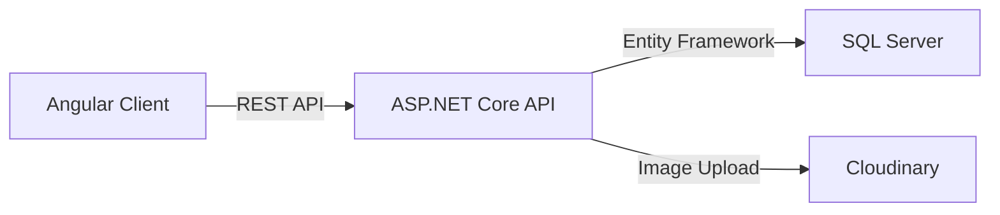

<div align="center">

# 🦈 Sharks Management System(freelance)

### _A Modern Barber Shop Management Platform_

[](https://shark-s-management-system.vercel.app/)

_Full-featured platform for managing branches, barbers, bookings, queues, orders, and customer feedback_

[Features](#-core-features) • [Tech Stack](#️-tech-stack) • [Architecture](#-system-architecture) • [Deployment](#-deployment)

</div>

---

## 📑 Table of Contents

- [🚀 Project Overview](#-project-overview)
- [🧱 System Architecture](#-system-architecture)
- [🛠️ Tech Stack](#️-tech-stack)
- [🔐 Authentication & Roles](#-authentication--roles)
- [✨ Core Features](#-core-features)
- [🗃️ Database Design](#️-database-design)
- [🐳 Deployment](#-deployment)
- [🧪 Mock Data & Testing](#-mock-data--testing)
- [👨‍💻 Developer](#-developer)

---

## 🚀 Project Overview

**Sharks Management System** is a comprehensive web-based platform designed for modern barber shop chains. Built with scalability and real-world business logic in mind, it provides:

- 📅 **Booking Management** - Complete appointment scheduling system
- 🏢 **Multi-Branch Operations** - Manage multiple locations seamlessly
- 🧍 **Real-Time Queue System** - Efficient customer flow management
- 🛒 **E-Commerce Integration** - Product orders and inventory
- 🔐 **Secure Authentication** - Role-based access control
- ⭐ **Feedback System** - Customer ratings and reviews

---

## 🧱 System Architecture



| Layer        | Technology           | Description                           |
| ------------ | -------------------- | ------------------------------------- |
| **Frontend** | Angular              | Modern SPA with TypeScript            |
| **Backend**  | ASP.NET Core Web API | RESTful API with .NET 9               |
| **Database** | SQL Server           | Relational database with EF Core      |
| **Storage**  | Cloudinary           | Image and media management            |
| **Hosting**  | Render + Vercel      | Backend on Render, Frontend on Vercel |

---

## 🛠️ Tech Stack

### Backend Technologies

<div align="center">


</div>

- **ASP.NET Core Web API** (.NET 9)
- **Entity Framework Core** - ORM with Code-First approach
- **ASP.NET Identity** - User management
- **JWT Authentication** - Secure token-based auth
- **Role-Based Authorization** - Fine-grained access control
- **Cloudinary** - Cloud-based image storage
- **Docker** - Containerized deployment

### Frontend Technologies

<div align="center">


</div>

- **Angular** - Modern component-based framework
- **TypeScript** - Type-safe development
- **RxJS** - Reactive programming
- **TailwindCSS** - Utility-first CSS framework

---

## 🔐 Authentication & Roles

The system implements **JWT + ASP.NET Identity** with comprehensive role-based access control:

<table>
<tr>
<th>Role</th>
<th>Permissions</th>
</tr>
<tr>
<td>🔴 <strong>Admin</strong></td>
<td>Full system access, manage all branches, users, and settings</td>
</tr>
<tr>
<td>🟡 <strong>Branch Manager</strong></td>
<td>Manage assigned branch, barbers, bookings, and orders</td>
</tr>
<tr>
<td>🟢 <strong>Barber</strong></td>
<td>View schedule, manage queue, complete bookings</td>
</tr>
<tr>
<td>🔵 <strong>Customer</strong></td>
<td>Book appointments, view history, submit feedback</td>
</tr>
</table>

### 🛡️ Security Features

- ✅ **Backend Authorization** - No client-side data tampering
- ✅ **Branch Isolation** - Managers access only their branch
- ✅ **Admin Protection** - Critical operations fully secured
- ✅ **Token Refresh** - Secure session management

---

## ✨ Core Features

<details open>
<summary><h3>🏢 Branch Management</h3></summary>

- ➕ Create and update branches
- 👤 Assign branch managers
- 🖼️ Upload branch images (Cloudinary)
- 📊 View branch statistics and analytics
- 📍 Location-based management

</details>

<details open>
<summary><h3>💇 Barber Management</h3></summary>

- 👨‍💼 Assign barbers to specific branches
- 📆 Configure weekly schedules
- 🪑 Chair assignment support
- 🔄 Queue-based service flow
- ⏰ Availability management

</details>

<details open>
<summary><h3>📅 Booking System</h3></summary>

Complete appointment management with:

| Feature                 | Description                                      |
| ----------------------- | ------------------------------------------------ |
| **Time Slots**          | Flexible scheduling with available slots         |
| **Barber Selection**    | Choose preferred barber or auto-assign           |
| **Branch Selection**    | Multi-location support                           |
| **Status Tracking**     | `Pending` → `Completed` / `Cancelled` / `NoShow` |
| **Payment Integration** | Track payment status per booking                 |

</details>

<details open>
<summary><h3>🧍 Queue Management System</h3></summary>

Real-time queue simulation for barbershop flow:

```
┌─────────────────────────────────────┐
│  Waiting Queue                      │
│  ├─ Customer 1 (Priority)           │
│  ├─ Customer 2                      │
│  └─ Customer 3                      │
└─────────────────────────────────────┘
           ↓
┌─────────────────────────────────────┐
│  Available Chairs                   │
│  ├─ Chair 1: Barber A → Customer 1  │
│  ├─ Chair 2: Barber B → Customer 2  │
│  └─ Chair 3: [Available]            │
└─────────────────────────────────────┘
```

**Features:**

- 🪑 Configurable chairs per branch
- 🎯 Auto-assign next customer when chair freed
- ⏱️ Priority-based waiting queue
- 📥 Manual enqueue support
- 📦 Archive completed bookings

</details>

<details open>
<summary><h3>🛒 E-Commerce Orders</h3></summary>

Full product management system:

- 📦 Product catalog (hair & beard care products)
- 🛍️ Order processing with multiple items
- 💳 Multiple payment methods
- 📊 Order tracking (`Pending`, `Completed`, `Cancelled`)
- 📈 Revenue analytics

</details>

<details open>
<summary><h3>⭐ Customer Feedback System</h3></summary>

Branch-specific rating system:

- ⭐ 0-5 star ratings per branch
- 🛡️ IP-based spam protection (24-hour cooldown)
- 💬 Text feedback support
- 📊 Aggregate ratings for analytics

</details>

---

## 🗃️ Database Design

Well-architected database schema optimized for performance:

| Design Principle  | Implementation                           |
| ----------------- | ---------------------------------------- |
| **Normalization** | Fully normalized schema (3NF)            |
| **Performance**   | Indexed queue tables for fast access     |
| **Precision**     | `decimal(18,2)` for monetary values      |
| **Integration**   | ASP.NET Identity seamlessly integrated   |
| **Analytics**     | Historical data for reporting & insights |

### 📊 Key Entities

- 👥 **Users** (Identity-based with custom claims)
- 🏢 **Branches** (Multi-location support)
- 💇 **Barbers** (Linked to branches and schedules)
- 📅 **Bookings** (Complete appointment history)
- 🧍 **Queue** (Real-time customer flow)
- 🛒 **Orders & Products** (E-commerce transactions)
- ⭐ **Feedback** (Branch ratings)

---

## 🐳 Deployment

### Docker Configuration

```dockerfile
# Multi-stage build for optimal image size
FROM mcr.microsoft.com/dotnet/sdk:9.0 AS build
# ... build steps
FROM mcr.microsoft.com/dotnet/aspnet:9.0
# ... production runtime
```

**Features:**

- ⚡ Multi-stage build (optimized size)
- 🏭 Production-ready container
- 🔧 Environment-based configuration
- 📦 Portable and scalable

### Hosting

<table>
<tr>
<th>Service</th>
<th>Platform</th>
<th>Features</th>
</tr>
<tr>
<td><strong>Backend API</strong></td>
<td></td>
<td>Automatic port binding, secure env vars, MSSQL support</td>
</tr>
<tr>
<td><strong>Frontend</strong></td>
<td></td>
<td>Edge network, automatic deployments, SSR support</td>
</tr>
<tr>
<td><strong>Database</strong></td>
<td></td>
<td>External managed database</td>
</tr>
</table>

### 📦 Environment Variables

```env
# Database
ConnectionStrings__DefaultConnection=Server=...;Database=...;User Id=...;Password=...

# JWT Configuration
Jwt__Key=your-secret-key-here
Jwt__Issuer=sharks-api
Jwt__Audience=sharks-client

# Cloudinary
Cloudinary__CloudName=your-cloud-name
Cloudinary__ApiKey=your-api-key
Cloudinary__ApiSecret=your-api-secret
```

---

## 🧪 Mock Data & Testing

The system includes comprehensive seed data for testing:

| Data Type       | Count      | Purpose                      |
| --------------- | ---------- | ---------------------------- |
| 🏢 **Branches** | Multiple   | Test multi-location features |
| 💇 **Barbers**  | Per Branch | Schedule and queue testing   |
| 📅 **Bookings** | 30+ days   | Historical analytics         |
| 🛒 **Orders**   | Varied     | E-commerce flow testing      |
| ⭐ **Feedback** | Per Branch | Rating system testing        |

**Perfect for:**

- 📊 Analytics dashboard development
- 🧪 Integration testing
- 🎨 UI/UX validation
- 📈 Performance benchmarking

---

## 🎯 Project Goals

<div align="center">

### Built with Real-World Business Logic

| Principle           | Implementation                                   |
| ------------------- | ------------------------------------------------ |
| 🏗️ **Architecture** | Clean separation of concerns (N-tier)            |
| 🔒 **Security**     | Industry-standard authentication & authorization |
| 📈 **Scalability**  | Designed for growth and high traffic             |
| 🧩 **Modularity**   | Easy to extend and maintain                      |

</div>

### 🚀 Roadmap

- [ ] 📊 Advanced analytics dashboards
- [ ] 🔔 Real-time notifications (SignalR)
- [ ] 📱 Mobile applications (iOS/Android)
- [ ] 💳 Payment gateway integration (PayPal, Stripe)
- [ ] 📧 Email/SMS notifications
- [ ] 🤖 AI-based scheduling optimization

---

## 👨‍💻 Developer

<div align="center">

### **Abanoub Milad**

_Full Stack Developer_

**Specialized in:**


</div>

---

## 📌 Project Status

<div align="center">


**⭐ If you find this project useful, please consider giving it a star!**

</div>

---

<div align="center">

Made by
[Abanoub Milad](https://github.com/AbanoubMilad)
[Abdallah farrag](https://github.com/Abdallahfarrag1)
[Mohammad Zein](https://github.com/mohammadze1n)

_Building scalable solutions for modern businesses_

</div>
